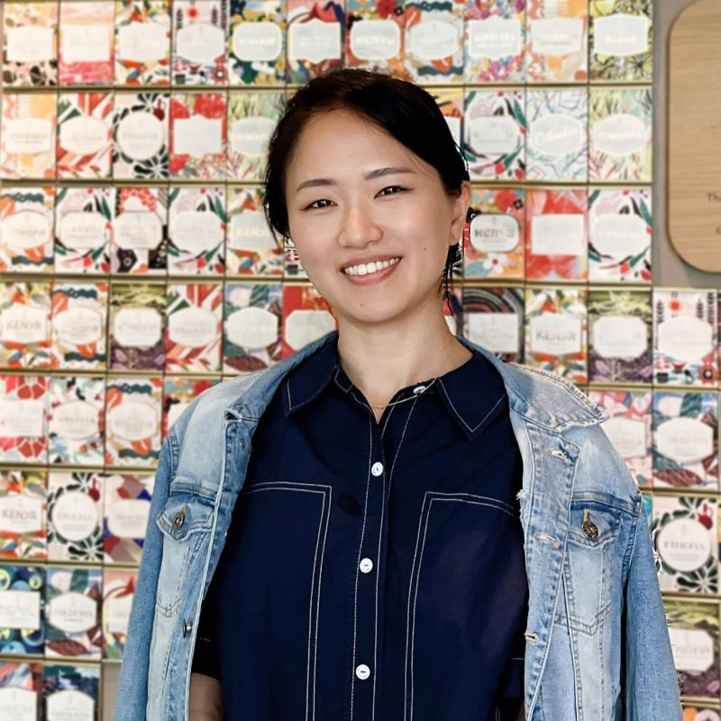
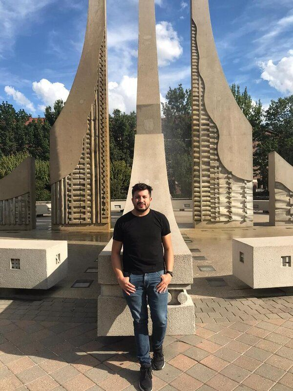
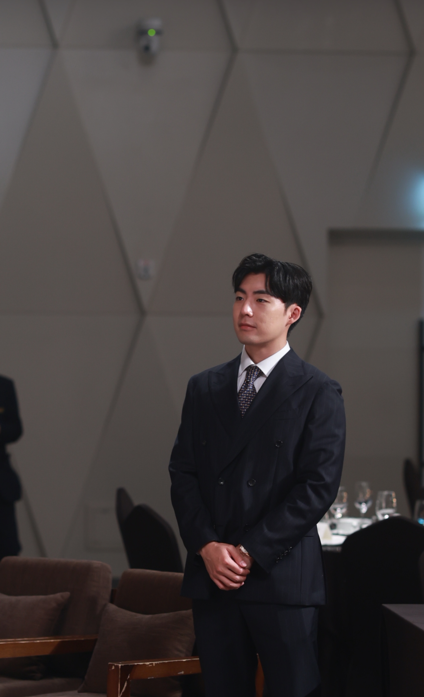
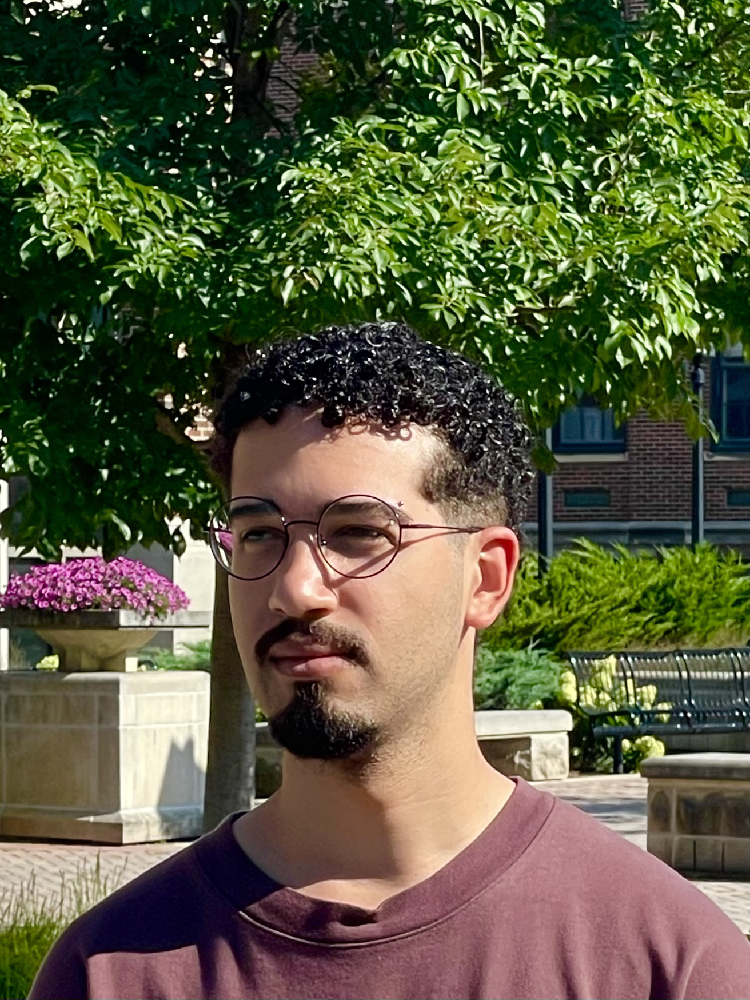

<!-- markdownlint-disable MD033 -->

<!-- Embedding Font Awesome for ORCID icon -->

<!-- Main -->

  <h4>Jump to Section</h4>
  <ul>
    <li><a href="#postdocs">Post-doctoral Fellows</a></li>
    <li><a href="#phds">Doctoral Students</a></li>
    <li><a href="#masters">Master's Students</a></li>
    <li><a href="#visitors">Visiting Scholars</a></li>
    <li><a href="#undergrads">Undergraduates</a></li>
    <li><a href="#pi">Principal Investigator</a></li>
    <li><a href="#alumni">Alumni</a></li>
  </ul>

<!-- Post-doctoral fellows -->
<section id="postdocs">
 

  <header class="major">
   <h2>Post-doctoral fellows</h2>
  </header>
 

</section>

<!-- Carolina Tristan -->
<section id="carolina-tristan" class="spotlights">
    <section>
     
     

      

       <header class="major">
        <h3>Carolina Tristan</h3>
       </header>
       <ul>
        <li>Joined in Jan 2024.</li>
        <li>Ph.D. Chemical Engineering, University of Cantabria, 2023.</li>
       </ul>
       
<b>Research topics</b>: Superstructure Optimization, Generalized Disjunctive Programming, Process System Engineering.

       <ul class="icons">
        <li><a href="https://www.linkedin.com/in/carolina-trist%C3%A1n-teja-3533582b4/" class="fab fa-linkedin" aria-label="Carolina Tristan LinkedIn Profile" target="_blank" target="_blank">LinkedIn</a></li>
        <li><a href="https://github.com/tristantc" class="fab fa-github" aria-label="Carolina Tristan GitHub Profile" target="_blank" target="_blank">GitHub</a></li>
        <li><a href="mailto:ctristan@purdue.edu" class="icon fa-envelope" aria-label="Email Carolina Tristan" target="_blank" target="_blank">Email</a></li>
        <li><a href="https://orcid.org/0000-0002-6381-5958" class="fab fa-orcid" aria-label="Carolina Tristan ORCID Profile" target="_blank" target="_blank">ORCID</a></li>
       </ul>
      

     

    </section>
</section>

<!-- Hamta Bardool -->
<section id="hamta-bardool" class="spotlights">
    <section>
     
     

      

       <header class="major">
        <h3>Hamta Bardool</h3>
       </header>
       <ul>
        <li>Joined in Summer 2024.</li>
        <li>Ph.D., Chemical Engineering, Purdue University/Shiraz University, 2023.</li>
       </ul>
       
<b>Research topics</b>: Reactor and catalysis modeling, simulation, and optimization.

       <ul class="icons">
        <li><a href="https://www.linkedin.com/in/hamta-bardool-6ba418116/" class="fab fa-linkedin" aria-label="Hamta Bardool LinkedIn Profile" target="_blank">LinkedIn</a></li>
        <li><a href="https://github.com/Hamtabardool" class="fab fa-github" aria-label="Hamta Bardool GitHub Profile" target="_blank">GitHub</a></li>
        <li><a href="mailto:hbardool@purdue.edu" class="icon fa-envelope" aria-label="Email Hamta Bardool" target="_blank">Email</a></li>
        <li><a href="https://orcid.org/0000-0002-6834-4913" class="fab fa-orcid" aria-label="Hamta Bardool ORCID Profile" target="_blank">ORCID</a></li>
       </ul>
      

     

   </section>
</section>

<!-- PhD students -->
<section id="phds">
 

  <header class="major">
   <h2>Doctoral students</h2>
  </header>
 

</section>

<!-- Albert Lee -->
<section id="albert-lee" class="spotlights">
 <section>
  
  

   

    <header class="major">
     <h3>Albert Lee</h3>
    </header>
    <ul>
      <li>Joined in Fall 2022.</li>
      <li>B.Eng. Chemical Engineering, Korea University, 2021.</li>
    </ul>
    
<b>Research topics</b>: Superstructure Optimization, Generalized Disjunctive Programming.

    <ul class="icons">
      <li><a href="https://www.linkedin.com/in/albert-lee-45570a24b/" class="fab fa-linkedin" aria-label="Albert Lee LinkedIn Profile" target="_blank">LinkedIn</a></li>
      <li><a href="https://github.com/AlbertLee125" class="fab fa-github" aria-label="Albert Lee GitHub Profile" target="_blank">GitHub</a></li>
      <li><a href="mailto:lee4382@purdue.edu" class="icon fa-envelope" aria-label="Email Albert Lee" target="_blank">Email</a></li>
      <li><a href="https://orcid.org/0000-0002-4474-3266" class="fab fa-orcid" aria-label="Albert Lee ORCID Profile" target="_blank">ORCID</a></li>
    </ul>
   

  

 </section>
</section>

<!-- Anurag Ramesh -->
<section id="anurag-ramesh" class="spotlights">
 <section>
  
  

   

    <header class="major">
     <h3>Anurag Ramesh</h3>
    </header>
    <ul>
      <li>Joined in Fall 2023</li>
      <li>B.Eng. Chemical Engineering, Birla Institute of Technology and Science Pilani, 2023.</li>
    </ul>
    
<b>Research topics</b>: Benchmarking Classical and Quantum Algorithms for Optimization and Computational Chemistry.

    <ul class="icons">
      <li><a href="https://www.linkedin.com/in/anuragr20" class="fab fa-linkedin" aria-label="Anurag Ramesh LinkedIn Profile" target="_blank">LinkedIn</a></li>
      <li><a href="https://github.com/anurag-r20" class="fab fa-github" aria-label="Anurag Ramesh GitHub Profile" target="_blank">GitHub</a></li>
      <li><a href="mailto:rames102@purdue.edu" class="icon fa-envelope" aria-label="Email Anurag Ramesh" target="_blank">Email</a></li>
      <li><a href="https://orcid.org/0009-0001-8360-8614" class="fab fa-orcid" aria-label="Anurag Ramesh ORCID Profile" target="_blank">ORCID</a></li>
    </ul>
   

  

 </section>
</section>

<!-- Yirang Park -->
<section id="yirang-park" class="spotlights">
 <section>
  
  

   

    <header class="major">
     <h3>Yirang Park</h3>
    </header>
    <ul>
    <li>Joined in Fall 2023</li>
    <li>B.Sc. Chemical Engineering, University of California, Berkeley, 2015.</li>
    <li>Professional M.Sc. Chemical Engineering, Purdue University, 2019.</li>
    </ul>
    
<b>Research topics</b>: Pharmaceutical Process Synthesis and Optimization.

    <ul class="icons">
      <li><a href="https://www.linkedin.com/in/yirangp/" class="fab fa-linkedin" aria-label="Yirang Park LinkedIn Profile" target="_blank">LinkedIn</a></li>
      <li><a href="https://github.com/parkyr" class="fab fa-github" aria-label="Yirang Park GitHub Profile" target="_blank">GitHub</a></li>
      <li><a href="mailto:park407@purdue.edu" class="icon fa-envelope" aria-label="Email Yirang Park" target="_blank">Email</a></li>
      <li><a href="https://orcid.org/0009-0008-6629-3308" class="fab fa-orcid" aria-label="Yirang Park ORCID Profile" target="_blank">ORCID</a></li>
    </ul>
   

  

 </section>
</section>

<!-- Pedro Maciel Xavier -->
<section id="pedro-maciel-xavier" class="spotlights">
 <section>
  
  

   

    <header class="major">
     <h3>Pedro Maciel Xavier</h3>
    </header>
    <ul>
    <li>Joined in Fall 2024. Visiting Scholar during Fall 2023.</li>
    <li>B.Eng. Computer &amp; Information Engineering, Federal University of Rio de Janeiro, 2022.</li>
    <li>B.Sc. Mathematics, Federal University of Rio de Janeiro, 2022.</li>
    </ul>
    
<b>Research topics</b>: Operations Research, Quantum Optimization

    <ul class="icons">
      <li><a href="https://www.linkedin.com/in/pedro-maciel-xavier/" class="fab fa-linkedin" aria-label="Pedro Maciel Xavier LinkedIn Profile" target="_blank">LinkedIn</a></li>
      <li><a href="https://github.com/pedromxavier" class="fab fa-github" aria-label="Pedro Maciel Xavier GitHub Profile" target="_blank">GitHub</a></li>
      <li><a href="mailto:pmacielx@purdue.edu" class="icon fa-envelope" aria-label="Email Pedro Maciel Xavier" target="_blank">Email</a></li>
      <li><a href="https://orcid.org/0000-0002-4678-4942" class="fab fa-orcid" aria-label="Pedro Maciel Xavier ORCID Profile" target="_blank">ORCID</a></li>
    </ul>
   

  

 </section>
</section>

<!-- Sergey Gusev -->
<section id="sergey-gusev" class="spotlights">
 <section>
  
  

   

    <header class="major">
     <h3>Sergey Gusev</h3>
    </header>
    <ul>
    <li>Joined in Fall 2024</li>
    <li>B.Eng. Chemical Engineering, Gubkin University, Moscow, 2016.</li>
    <li>MSEng, Chemical Engineering, Monash University, Melbourne, 2019.</li>
    </ul>
    
<b>Research topics</b>: Hybrid Quantum Algorithms for Structured Optimization Problems in Process Systems Engineering.

    <ul class="icons">
      <li><a href="https://www.linkedin.com/in/sergey-gusev-0b7770150/" class="fab fa-linkedin" aria-label="Sergey Gusev LinkedIn Profile" target="_blank">LinkedIn</a></li>
      <li><a href="https://github.com/sergey-gusev94" class="fab fa-github" aria-label="Sergey Gusev GitHub Profile" target="_blank">GitHub</a></li>
      <li><a href="mailto:sgusev@purdue.edu" class="icon fa-envelope" aria-label="Email Sergey Gusev" target="_blank">Email</a></li>
    </ul>
   

  

 </section>
</section>

<!-- Andres F. Cabeza -->
<section id="andres-cabeza" class="spotlights">
 <section>
  
  

   

    <header class="major">
     <h3>Andres F. Cabeza</h3>
    </header>
    <ul>
    <li>Joined in Fall 2024</li>
    <li>B.Eng. Chemical Engineering, Universidad Nacional de Colombia, Manizales, 2017.</li>
    <li>M.Sc. Chemical Engineering, Universidad Nacional de Colombia, Bogotá, 2023.</li>
    </ul>
    
<b>Research topics</b>: Optimization-aided process synthesis and operations

    <ul class="icons">
      <li><a href="https://www.linkedin.com/in/andres-f-cabeza-2075a3149/" class="fab fa-linkedin" aria-label="Andres F. Cabeza LinkedIn Profile" target="_blank">LinkedIn</a></li>
      <li><a href="https://github.com/andres9403" class="fab fa-github" aria-label="Andres F. Cabeza GitHub Profile" target="_blank">GitHub</a></li>
      <li><a href="mailto:acabezap@purdue.edu" class="icon fa-envelope" aria-label="Email Andres F. Cabeza" target="_blank">Email</a></li>
      <li><a href="https://orcid.org/0009-0008-5932-564X" class="fab fa-orcid" aria-label="Andres F. Cabeza ORCID Profile" target="_blank">ORCID</a></li>
    </ul>
   

  

 </section>
</section>

<!-- Master's students -->
<section id="masters">
 

  <header class="major">
   <h2>Master's students</h2>
  </header>
 

</section> 

<!-- Woosik Kim -->
<section id="woosik-kim" class="spotlights">
 <section>
  
  

   

    <header class="major">
     <h3>Woosik Kim</h3>
    </header>
    <ul>
      <li>Joined in Fall 2025.</li>
      <li>B.Sc. Computer Engineering, Purdue University, 2024.</li>
    </ul>
    
<b>Research topics</b>: Quantum Optimization.

    <ul class="icons">
      <li><a href="https://www.linkedin.com/in/kimwoosik/" class="fab fa-linkedin" aria-label="Woosik Kim LinkedIn Profile" target="_blank">LinkedIn</a></li>
      <li><a href="https://github.com/peterkim01" class="fab fa-github" aria-label="Woosik Kim GitHub Profile" target="_blank">GitHub</a></li>
      <li><a href="mailto:kim3124@purdue.edu" class="icon fa-envelope" aria-label="Email Woosik Kim" target="_blank">Email</a></li>
    </ul>
   

  

 </section>
</section>

<!-- Visiting scholars -->
<section id="visitors">
 

  <header class="major">
   <h2>Visiting scholars</h2>
  </header>
 

</section>

<!-- Mateo Huertas Marulanda -->
<section id="mateo-huertas-marulanda" class="spotlights">
 <section>
  
  

   

    <header class="major">
     <h3>Mateo Huertas Marulanda</h3>
    </header>
    <ul>
    <li>Joined in Spring 2025.</li>
    <li>B.Sc. Chemical Engineering, National University of Colombia, 2025.</li>
    </ul>
    
<b>Research topics</b>: Process Control, Machine Learning and Optimization.

    <ul class="icons">
      <li><a href="https://www.linkedin.com/in/mhuertasm/" class="fab fa-linkedin" aria-label="Mateo Huertas Marulanda LinkedIn Profile" target="_blank">LinkedIn</a></li>
      <li><a href="https://github.com/mhuertasm" class="fab fa-github" aria-label="Mateo Huertas Marulanda GitHub Profile" target="_blank">GitHub</a></li>
    </ul>
   

  

 </section>
</section>

<!-- Daniel Anoruo -->
<section id="daniel-anoruo" class="spotlights">
 <section>
  
  

   

    <header class="major">
     <h3>Daniel Anoruo</h3>
    </header>
    <ul>
    <li>Joined in Summer 2025.</li>
    <li>B.Sc. Computer Science, Towson University, expected 2026.</li>
    </ul>
    
<b>Research topics</b>: Federated Learning, Machine Learning, Quantum Computing

    <ul class="icons">
      <li><a href="https://www.linkedin.com/in/danano/" class="fab fa-linkedin" aria-label="Daniel Anoruo LinkedIn Profile" target="_blank">LinkedIn</a></li>
      <li><a href="https://github.com/danoruo1" class="fab fa-github" aria-label="Daniel Anoruo GitHub Profile" target="_blank">GitHub</a></li>
    </ul>
   

  

 </section>
</section>

<!-- João Victor Paim -->
<section id="joao-victor" class="spotlights">
 <section>
  
  

   

    <header class="major">
     <h3>João Victor Paim</h3>
    </header>
    <ul>
    <li>Joined in Fall 2025.</li>
    <li>B.Eng. Computer Engineering, Military Institute Of Engineering, expected 2026.</li>
    </ul>
    
<b>Research topics</b>: Machine Learning, Quantum Computing, Optimization

    <ul class="icons">
      <li><a href="https://github.com/jvpcms" class="fab fa-github" aria-label="João Victor's GitHub Profile" target="_blank">GitHub</a></li>
      <li><a href="https://www.linkedin.com/in/jo%C3%A3ovictor-engenharia/" class="fab fa-linkedin" aria-label="João Victor's LinkedIn Profile" target="_blank">LinkedIn</a></li>
      <li><a href="mailto:jpaimdec@purdue.edu" class="icon fa-envelope" aria-label="Email João Victor" target="_blank">Email</a></li>
    </ul>
   

  

 </section>
</section>

<!-- Undergraduate students -->
<section id="undergrads">
 

  <header class="major">
   <h2>Undergraduates</h2>
  </header>
 

</section>

<!-- Alexander (AJ) Collins -->
<section id="aj-collins" class="spotlights">
 <section>
  
  

   

    <header class="major">
     <h3>Alexander (AJ) Collins</h3>
    </header>
    <ul>
    <li>Joined in Spring 2025.</li>
    <li>B.Sc. Integrated Business and Engineering, Purdue University, expected May 2027.</li>
    </ul>
    
<b>Research topics</b>: Marketing and Business Analytics.

    <ul class="icons">
      <li><a href="https://www.linkedin.com/in/alexandercollins3/" class="fab fa-linkedin" aria-label="Alexander Collins LinkedIn Profile" target="_blank">LinkedIn</a></li>
      <li><a href="https://github.com/colli525" class="fab fa-github" aria-label="Alexander Collins GitHub Profile" target="_blank">GitHub</a></li>
      <li><a href="mailto:colli525@purdue.edu" class="icon fa-envelope" aria-label="Email Alexander Collins" target="_blank">Email</a></li>
    </ul>
   

  

 </section>
</section>

<!-- Ben Murray -->
<section id="ben-murray" class="spotlights">
 <section>
  
  

   

    <header class="major">
     <h3>Ben Murray</h3>
    </header>
    <ul>
    <li>Joined in Spring 2024.</li>
    <li>B.Sc. Chemical Engineering, Purdue University, expected May 2025.</li>
    </ul>
    
<b>Research topics</b>: Optimization of reliability design.

    <ul class="icons">
      <li><a href="https://www.linkedin.com/in/murraybj/" class="fab fa-linkedin" aria-label="Ben Murray LinkedIn Profile" target="_blank">LinkedIn</a></li>
      <li><a href="https://github.com/murraybj" class="fab fa-github" aria-label="Ben Murray GitHub Profile" target="_blank">GitHub</a></li>
    </ul>
   

  

 </section>
</section>

<!-- Akshay Mahajan -->
<section id="akshay-mahajan" class="spotlights">
 <section>
  
  

   

    <header class="major">
     <h3>Akshay Mahajan</h3>
    </header>
    <ul>
    <li>Joined in Spring 2025.</li>
    <li>B.Sc. Chemical Engineering, Purdue University, expected May 2026.</li>
    </ul>
    
<b>Research topics</b>: Process Systems Machine Learning.

    <ul class="icons">
      <li><a href="https://www.linkedin.com/in/akshay-mahajan-b01122232/" class="fab fa-linkedin" aria-label="Akshay Mahajan LinkedIn Profile" target="_blank">LinkedIn</a></li>
      <li><a href="https://github.com/akrmahajan" class="fab fa-github" aria-label="Akshay Mahajan GitHub Profile" target="_blank">GitHub</a></li>
      <li><a href="mailto:mahaja34@purdue.edu" class="icon fa-envelope" aria-label="Email Akshay Mahajan" target="_blank">Email</a></li>
    </ul>
   

  

 </section>
</section>

<!-- Sai Karthik -->
<section id="sai-karthik" class="spotlights">
 <section>
  
  

   

    <header class="major">
     <h3>Sai Karthik</h3>
    </header>
    <ul>
    <li>Joined in Spring 2025.</li>
    <li>B.Sc. Biomedical Engineering, Purdue University, expected December 2026.</li>
    </ul>
    
<b>Research topics</b>: Pharmaceutical Process Synthesis and Optimization.

    <ul class="icons">
      <li><a href="https://www.linkedin.com/in/saivisvesh-karthik/" class="fab fa-linkedin" aria-label="Sai Karthik LinkedIn Profile" target="_blank">LinkedIn</a></li>
      <li><a href="https://github.com/sa1K" class="fab fa-github" aria-label="Sai Karthik GitHub Profile" target="_blank">GitHub</a></li>
      <li><a href="mailto:karthik9@purdue.edu" class="icon fa-envelope" aria-label="Email Sai Karthik" target="_blank">Email</a></li>
    </ul>
   

  

 </section>
</section>

<!-- Alan Yi -->
<section id="alan-yi" class="spotlights">
 <section>
  
  

   

    <header class="major">
     <h3>Alan Yi</h3>
    </header>
    <ul>
    <li>Joined in Summer 2025.</li>
    <li>B.Sc. Computer Science, Purdue University, expected May 2027.</li>
    </ul>
    
<b>Research topics</b>: Quantum Federated Learning for Biomedical Applications.

    <ul class="icons">
      <li><a href="https://www.linkedin.com/in/alan-s-yi/" class="fab fa-linkedin" aria-label="Alan Yi LinkedIn Profile" target="_blank">LinkedIn</a></li>
      <li><a href="https://github.com/ailunyi" class="fab fa-github" aria-label="Alan Yi GitHub Profile" target="_blank">GitHub</a></li>
      <li><a href="mailto:yi161@purdue.edu" class="icon fa-envelope" aria-label="Email Alan Yi" target="_blank">Email</a></li>
    </ul>
   

  

 </section>
</section>

<!-- Azain Khalid -->
<section id="azain-khalid" class="spotlights">
 <section>
  
  

   

    <header class="major">
     <h3>Azain Khalid</h3>
    </header>
    <ul>
    <li>Joined in Summer 2025.</li>
    <li>B.Sc. Computer Science, Purdue University, expected May 2028.</li>
    </ul>
    
<b>Research topics</b>: Quantum Integer Programming and Machine Learning

    <ul class="icons">
      <li><a href="https://www.linkedin.com/in/azainkhalid/" class="fab fa-linkedin" aria-label="Azain Khalid LinkedIn Profile" target="_blank">LinkedIn</a></li>
      <li><a href="https://github.com/AzAINN" class="fab fa-github" aria-label="Azain Khalid GitHub Profile" target="_blank">GitHub</a></li>
      <li><a href="mailto:khalid18@purdue.edu" class="icon fa-envelope" aria-label="Email Azain Khalid" target="_blank">Email</a></li>
      <li><a href="https://orcid.org/0009-0005-4801-6452" class="fab fa-orcid" aria-label="Azain Khalid ORCID Profile" target="_blank">ORCID</a></li>
    </ul>
   

  

 </section>
</section>

<!-- Principal Investigator -->
<section id="pi">
 

  <header class="major">
   <h2>Principal Investigator</h2>
  </header>
 

</section>

<!-- David Bernal Neira -->
<section id="david-bernal" class="spotlights">
  <section>
    
  

   

    <header class="major">
     <h3>David E. Bernal Neira</h3>
    </header>
    <ul>
      <li>Started officially in Fall 2023.</li>
      <li><a href="1-bernalde.html">Main information</a>.</li>
    </ul>
    <ul class="icons">
      <li><a href="https://www.linkedin.com/in/bernalde/" class="fab fa-linkedin" aria-label="David E. Bernal Neira LinkedIn Profile" target="_blank">LinkedIn</a></li>
      <li><a href="mailto:dbernaln@purdue.edu" class="icon fa-envelope" aria-label="Email David E. Bernal Neira" target="_blank">Email</a></li>
      <li><a href="https://github.com/bernalde" class="fab fa-github" aria-label="David E. Bernal Neira GitHub Profile" target="_blank">GitHub</a></li>
      <li><a href="https://orcid.org/0000-0002-8308-5016" class="fab fa-orcid" aria-label="David E. Bernal Neira ORCID Profile" target="_blank">ORCID</a></li>
    </ul>
   

  

 </section>
</section>

<!-- Alumni -->
<section id="alumni">
 

  <header class="major">
   <h2>Alumni</h2>
  </header>
       <h3 style="margin-top: 20px; margin-bottom: 5px;">Postdoctoral fellows</h3>
       <ul class="alumni-list icons" style="margin: 0; padding: 0; list-style: none;">
      <li style="margin-bottom: 5px;">2024. Zedong Peng. MIT.
      <a href="https://www.linkedin.com/in/zedong-peng-1a97b0118/" class="fab fa-linkedin" aria-label="Zedong Peng LinkedIn Profile" target="_blank">LinkedIn</a>
      <a href="https://github.com/ZedongPeng" class="fab fa-github" aria-label="Zedong Peng GitHub Profile" target="_blank">GitHub</a>
      <a href="https://orcid.org/0000-0001-6001-1738" class="fab fa-orcid" aria-label="Zedong Peng ORCID Profile" target="_blank">ORCID</a>
      </li>
      </ul>
      <ul class="alumni-list icons" style="margin: 0; padding: 0; list-style: none;">
      <li style="margin-bottom: 5px;">2024. Amandeep Singh Bhatia. North Carolina State University.
      <a href="https://www.linkedin.com/in/amandeep-singh-bhatia-phd-07b83822/" class="fab fa-linkedin" aria-label="Amandeep Singh Bhatia LinkedIn Profile" target="_blank">LinkedIn</a>
      <a href="https://github.com/deepquantum88" class="fab fa-github" aria-label="Amandeep Singh Bhatia GitHub Profile" target="_blank">GitHub</a>
      </li>
      </ul>
      <h3 style="margin-top: 20px; margin-bottom: 5px;">Visiting scholars</h3>
      <ul class="alumni-list icons" style="margin: 0; padding: 0; list-style: none;">
      <li style="margin-bottom: 5px;">2024. Iago Leal de Freitas. Federal University of Rio de Janeiro.
      <a href="https://github.com/alimaala2002" class="fab fa-github" aria-label="Iago Leal de Freitas GitHub Profile" target="_blank">GitHub</a>
      <a href="https://www.linkedin.com/in/iagolealf/" class="fab fa-linkedin" aria-label="Iago Leal de Freitas LinkedIn Profile" target="_blank">LinkedIn</a>
      </li>
      </ul>
      <ul class="alumni-list icons" style="margin: 0; padding: 0; list-style: none;">
      <li style="margin-bottom: 5px;">2024. André Lima Alambert. University of Sao Paulo.
      <a href="https://github.com/iagoleal" class="fab fa-github" aria-label="André Lima Alambert GitHub Profile" target="_blank">GitHub</a>
      <a href="https://www.linkedin.com/in/andr%C3%A9-lima-alambert-301078292/" class="fab fa-linkedin" aria-label="André Lima Alambert LinkedIn Profile" target="_blank">LinkedIn</a>
      <a href="https://orcid.org/0009-0001-6813-5863" class="fab fa-orcid" aria-label="André Lima Alambert ORCID Profile" target="_blank">ORCID</a>
      </li>
      </ul>
      <ul class="alumni-list icons" style="margin: 0; padding: 0; list-style: none;">
      <li style="margin-bottom: 5px;">2024. Andres F. Cabeza. Purdue University.
      <a href="https://github.com/andres9403" class="fab fa-github" aria-label="Andres F. Cabeza GitHub Profile" target="_blank">GitHub</a>
      <a href="https://www.linkedin.com/in/andres-f-cabeza-2075a3149/" class="fab fa-linkedin" aria-label="Andres F. Cabeza LinkedIn Profile" target="_blank">LinkedIn</a>
      <a href="https://orcid.org/0009-0008-5932-564X" class="fab fa-orcid" aria-label="Andres F. Cabeza ORCID Profile" target="_blank">ORCID</a>
      </li>
      </ul>
      <ul class="alumni-list icons" style="margin: 0; padding: 0; list-style: none;">
      <li style="margin-bottom: 5px;">2024. Juan S. Rodríguez F. AgroParisTech Université Paris-Saclay.
      <a href="https://github.com/jsrodriguezf" class="fab fa-github" aria-label="Juan S. Rodríguez F. GitHub Profile" target="_blank">GitHub</a>
      <a href="https://orcid.org/0000-0001-7348-3857" class="fab fa-orcid" aria-label="Juan S. Rodríguez F. ORCID Profile" target="_blank">ORCID</a>
      </li>
      </ul>
      <ul class="alumni-list icons" style="margin: 0; padding: 0; list-style: none;">
      <li style="margin-bottom: 5px;">2023. Pedro Maciel Xavier. Purdue University.
      <a href="https://github.com/pedromxavier" class="fab fa-github" aria-label="Pedro Maciel Xavier GitHub Profile" target="_blank">GitHub</a>
      <a href="https://www.linkedin.com/in/pedro-maciel-xavier/" class="fab fa-linkedin" aria-label="Pedro Maciel Xavier LinkedIn Profile" target="_blank">LinkedIn</a>
      <a href="https://orcid.org/0000-0002-4678-4942" class="fab fa-orcid" aria-label="Pedro Maciel Xavier ORCID Profile" target="_blank">ORCID</a>
      </li>
      </ul>
      <h3 style="margin-top: 20px; margin-bottom: 5px;">Undergraduates</h3>
      <ul class="alumni-list icons" style="margin: 0; padding: 0; list-style: none;">
      <li style="margin-bottom: 5px;">2024. Sergio Barrios. Imperial College London.
      <a href="https://www.linkedin.com/in/sergio-barrios-rosado/" class="fab fa-linkedin" aria-label="Sergio Barrios LinkedIn Profile" target="_blank">LinkedIn</a>
      <a href="https://github.com/barrios2001" class="fab fa-github" aria-label="Sergio Barrios GitHub Profile" target="_blank">GitHub</a>
      </li>
      </ul>
      <ul class="alumni-list icons" style="margin: 0; padding: 0; list-style: none;">
      <li style="margin-bottom: 5px;">2024. Dhruv Mendpara. Purdue University.
      <a href="https://www.linkedin.com/in/dhruv-mendpara-594875237/" class="fab fa-linkedin" aria-label="Dhruv Mendpara LinkedIn Profile" target="_blank">LinkedIn</a>
      <a href="https://github.com/dhruvmendpara1" class="fab fa-github" aria-label="Dhruv Mendpara GitHub Profile" target="_blank">GitHub</a>
      </li>
      </ul>
      <ul class="alumni-list icons" style="margin: 0; padding: 0; list-style: none;">
      <li style="margin-bottom: 5px;">2024. Lukas Peng. Purdue University.
      <a href="https://www.linkedin.com/in/lukas-peng/" class="fab fa-linkedin" aria-label="Lukas Peng LinkedIn Profile" target="_blank">LinkedIn</a>
      <a href="https://github.com/lukaspeng" class="fab fa-github" aria-label="Lukas Peng GitHub Profile" target="_blank">GitHub</a>
      </li>
      </ul>
      <ul class="alumni-list icons" style="margin: 0; padding: 0; list-style: none;">
      <li style="margin-bottom: 5px;">2024. Keegan Duffin. Purdue University.
      <a href="https://www.linkedin.com/in/keeganduffin/" class="fab fa-linkedin" aria-label="Keegan Duffin LinkedIn Profile" target="_blank">LinkedIn</a>
      <a href="https://github.com/keeganlduffin" class="fab fa-github" aria-label="Keegan Duffin GitHub Profile" target="_blank">GitHub</a>
      </li>
      </ul>
      <ul class="alumni-list icons" style="margin: 0; padding: 0; list-style: none;">
      <li style="margin-bottom: 5px;">2024. Dale Stager. Purdue University.
      <a href="https://www.linkedin.com/in/dale-stager/" class="fab fa-linkedin" aria-label="Dale Stager LinkedIn Profile" target="_blank">LinkedIn</a>
      <a href="https://github.com/Landbanana" class="fab fa-github" aria-label="Dale Stager GitHub Profile" target="_blank">GitHub</a>
      </li>
      </ul>
      <ul class="alumni-list icons" style="margin: 0; padding: 0; list-style: none;">
      <li style="margin-bottom: 5px;">2024. Abigail Delaney. Imperial College London.
        <a href="https://www.linkedin.com/in/abby-delaney-693b4321a/" class="fab fa-linkedin" aria-label="Abigail Delaney LinkedIn Profile" target="_blank">LinkedIn</a>
        <a href="https://github.com/abdelane" class="fab fa-github" aria-label="Abigail Delaney GitHub Profile" target="_blank">GitHub</a>
      </li>
      </ul>

<section id="map" class="spotlights">
  

    <header class="major">
      <h2>Our Members' Locations</h2>
    </header>
    

      <iframe
        src="https://www.google.com/maps/d/u/0/embed?mid=1ZXM37lZ9Srrh5txcAA3a-oaURN0XbCw"
        width="100%"
        height="450"
        style="border:0; position: absolute; top: 0; left: 0; width: 100%; height: 100%;"
        allowfullscreen=""
        loading="lazy"
        referrerpolicy="no-referrer-when-downgrade"
        title="Map of SECQUOIA Group Members' Locations">
      </iframe>
    

  

</section>
