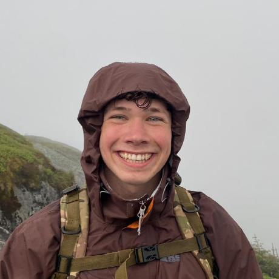

<!-- markdownlint-disable MD033 -->

<!-- Embedding Font Awesome for ORCID icon -->

<!-- Main -->

<!-- 1 -->
<section id="one">
 

  <header class="major">
   <h2>Post-doctoral fellows</h2>
  </header>
 

</section>

<!-- 1.1 -->

<!-- 1.2 -->
<section id="one-two" class="spotlights">
    <section>
     
     

      

       <header class="major">
        <h3>Carolina Tristan</h3>
       </header>
       <li>Joined in Jan 2024.</li>
       <li>Ph.D., Chemical Engineering, University of Cantabria, 2023.</li>
                   
<b>Research topics</b>: Superstructure Optimization, Generalized Disjunctive Programming, Process System Engineering.

      <!-- <h4>Icons</h4> -->
    <ul class="icons">
     <li><a href="https://www.linkedin.com/in/carolina-trist%C3%A1n-teja-3533582b4/" class="fa-brands fa-linkedin">Linkedin</a></li>
     <li><a href="https://github.com/tristantc" class="fa-brands fa-github">GitHub</a></li>
     <li><a href="mailto:ctristan@purdue.edu" class="icon fa-envelope">Email</a></li>
     <li><a href="https://orcid.org/0000-0002-6381-5958" class="fa-brands fa-orcid">ORCIDORCID</a></li>
    </ul>
     

    

   </section>
</section>

<section id="two" class="spotlights">
    <section>
     
     

      

       <header class="major">
        <h3>Hamta Bardool</h3>
       </header>
       <li>Joined in Summer 2024.</li>
       <li>Ph.D., Chemical Engineering, Purdue University/Shiraz University, 2023.</li>
                   
<b>Research topics</b>: Reactor and catalysis modeling, simulation, and optimization.

      <!-- <h4>Icons</h4> -->
    <ul class="icons">
     <li><a href="https://www.linkedin.com/in/hamta-bardool-6ba418116/" class="fa-brands fa-linkedin">Linkedin</a></li>
     <li><a href="https://github.com/Hamtabardool" class="fa-brands fa-github">GitHub</a></li>
     <li><a href="mailto:hbardool@purdue.edu" class="icon fa-envelope">Email</a></li>
     <li><a href="https://orcid.org/0000-0002-6834-4913" class="fa-brands fa-orcid">ORCIDORCID</a></li>
    </ul>
     

    

   </section>
</section>

<!-- Three -->
<section id="three">
 

  <header class="major">
   <h2>Doctoral students</h2>
  </header>
 

</section>

<!-- 2.1 -->
<section id="two-one" class="spotlights">
 <section>
  
  

   

    <header class="major">
     <h3>Albert Lee</h3>
    </header>
    <li>Joined in Fall 2022.</li>
    <li>B.Eng., Chemical Engineering, Korea University, 2021.</li>
    
<b>Research topics</b>: Superstructure Optimization, Generalized Disjunctive Programming.

    <ul class="icons">
     <li><a href="https://www.linkedin.com/in/albert-lee-45570a24b/" class="fa-brands fa-linkedin">Linkedin</a></li>
     <li><a href="https://github.com/AlbertLee125" class="fa-brands fa-github">GitHub</a></li>
     <li><a href="mailto:lee4382@purdue.edu" class="icon fa-envelope">Email</a></li>
     <li><a href="https://orcid.org/0000-0002-4474-3266" class="fa-brands fa-orcid">ORCIDORCID</a></li>
    </ul>
   

  

 </section>
</section>

<!-- 2.2 -->
<section id="two-two" class="spotlights">
 <section>
  
  

   

    <header class="major">
     <h3>Anurag Ramesh</h3>
    </header>
    <li>Joined in Fall 2023</li>
    <li>BE, Chemical Engineering, Birla Institute of Technology and Science Pilani, 2023.</li>
    
<b>Research topics</b>: Benchmarking Classical and Quantum Algorithms for Optimization and Computational Chemistry.

    <ul class="icons">
     <li><a href="https://www.linkedin.com/in/anuragr20" class="fa-brands fa-linkedin">Linkedin</a></li>
     <li><a href="https://github.com/anurag-r20" class="fa-brands fa-github">GitHub</a></li>
     <li><a href="mailto:rames102@purdue.edu" class="icon fa-envelope">Email</a></li>
     <li><a href="https://orcid.org/0009-0001-8360-8614" class="fa-brands fa-orcid">ORCIDORCID</a></li>
    </ul>
   

  

 </section>
</section>

<!-- 2.3 -->
<section id="two-three" class="spotlights">
 <section>
  
  

   

    <header class="major">
     <h3>Yirang Park</h3>
    </header>
    <li>Joined in Fall 2023</li>
    <li>B.Sc., Chemical Engineering, University of California, Berkeley, 2015.</li>
    <li>Professional M.Sc., Chemical Engineering, Purdue University, 2019.</li>
    
<b>Research topics</b>: Pharmaceutical Process Synthesis and Optimization.

    <ul class="icons">
     <li><a href="https://www.linkedin.com/in/yirangp/" class="fa-brands fa-linkedin">Linkedin</a></li>
     <li><a href="https://github.com/parkyr" class="fa-brands fa-github">GitHub</a></li>
     <li><a href="mailto:park407@purdue.edu" class="icon fa-envelope">Email</a></li>
     <li><a href="https://orcid.org/0009-0008-6629-3308" class="fa-brands fa-orcid">ORCIDORCID</a></li>
    </ul>
   

  

 </section>
</section>

<!-- 2.4 -->
<section id="two-four" class="spotlights">
 <section>
  
  

   

    <header class="major">
     <h3>Pedro Maciel Xavier</h3>
    </header>
    <li>Joined in Fall 2024. Visiting Scholar during Fall 2023.</li>
    <li>B.Eng., Computer &amp; Information Engineering, Federal University of Rio de Janeiro, 2022.</li>
    <li>B.Sc., Mathematics, Federal University of Rio de Janeiro, 2022.</li>
    
<b>Research topics</b>: Operations Research, Quantum Optimization

    <ul class="icons">
     <li><a href="https://www.linkedin.com/in/pedro-maciel-xavier/" class="fa-brands fa-linkedin">Linkedin</a></li>
     <li><a href="https://github.com/pedromxavier" class="fa-brands fa-github">GitHub</a></li>
     <li><a href="mailto:pmacielx@purdue.edu" class="icon fa-envelope">Email</a></li>
     <li><a href="https://orcid.org/0000-0002-4678-4942" class="fa-brands fa-orcid">ORCIDORCID</a></li>
    </ul>
   

  

 </section>
</section>

<!-- 2.5 -->
<section id="two-five" class="spotlights">
 <section>
  
  

   

    <header class="major">
     <h3>Sergey Gusev</h3>
    </header>
    <li>Joined in Fall 2024</li>
    <li>B.Eng., Chemical Engineering, Gubkin University, Moscow, 2016.</li>
    <li>MSEng, Chemical Engineering, Monash University, Melbourne, 2019.</li>
    
<b>Research topics</b>: Hybrid Quantum Algorithms for Structured Optimization Problems in Process Systems Engineering.

    <ul class="icons">
     <li><a href="https://www.linkedin.com/in/sergey-gusev-0b7770150/" class="fa-brands fa-linkedin">Linkedin</a></li>
     <li><a href="https://github.com/sergey-gusev94" class="fa-brands fa-github">GitHub</a></li>
     <li><a href="mailto:sgusev@purdue.edu" class="icon fa-envelope">Email</a></li>
    </ul>
   

  

 </section>
</section>

<!-- 2.6 -->

<section id="two-six" class="spotlights">
 <section>
  
  

   

    <header class="major">
     <h3>Andres F. Cabeza</h3>
    </header>
    <li>Joined in Fall 2024</li>
    <li>B.Eng., Chemical Engineering, Universidad Nacional de Colombia, Manizales, 2017.</li>
    <li>M.Sc., Chemical Engineering, Universidad Nacional de Colombia, Bogotá, 2023.</li>
    
<b>Research topics</b>: Optimization-aided process synthesis and operations

    <ul class="icons">
     <li><a href="https://www.linkedin.com/in/andres-f-cabeza-2075a3149/" class="fa-brands fa-linkedin">Linkedin</a></li>
     <li><a href="https://github.com/andres9403" class="fa-brands fa-github">GitHub</a></li>
     <li><a href="mailto:acabezap@purdue.edu" class="icon fa-envelope">Email</a></li>
     <li><a href="https://orcid.org/0009-0008-5932-564X" class="fa-brands fa-orcid">ORCIDORCID</a></li>
    </ul>
   

  

 </section>
</section>

<!-- 3 -->
<section id="three">
 

  <header class="major">
   <h2>Visiting scholars</h2>
  </header>
 

</section>

<!-- 3.5 -->
<section id="three-five" class="spotlights">
 <section>
  
  

   

    <header class="major">
     <h3>Mateo Huertas Marulanda</h3>
    </header>
    <li>Joined in Spring 2025.</li>
    <li>BSc, Chemical Engineering, National University of Colombia, 2025.</li>
    
<b>Research topic</b>: Process Control, Machine Learning and Optimization.

    <ul class="icons">
     <li><a href="https://www.linkedin.com/in/mhuertasm/" class="fa-brands fa-linkedin">Linkedin</a></li>
     <li><a href="https://github.com/mhuertasm" class="fa-brands fa-github">GitHub</a></li>
    </ul>
   

  

 </section>
</section>

<!-- 3.5 -->
<section id="three-five" class="spotlights">
 <section>
  
  

   

    <header class="major">
     <h3>Daniel Anoruo</h3>
    </header>
    <li>Joined in Summer 2025.</li>
    <li>BSc, Computer Science, Towson University, 2026.</li>
    
<b>Research topic</b>: Federated Learning, Machine Learning, Quatum Computing

    <ul class="icons">
     <li><a href="https://www.linkedin.com/in/danano/" class="fa-brands fa-linkedin">Linkedin</a></li>
     <li><a href="https://github.com/danoruo1" class="fa-brands fa-github">GitHub</a></li>
    </ul>
   

  

 </section>
</section>

<!-- 98 -->
<section id="ninety-eight">
 

  <header class="major">
   <h2>Undergraduates</h2>
  </header>
 

</section>

<!-- 3.4 -->
<section id="three-four" class="spotlights">
 <section>
  
  

   

    <header class="major">
     <h3>Alexander (AJ) Collins</h3>
    </header>
    <li>Joined in Spring 2025.</li>
    <li>BS Integrated Business and Engineering, Purdue University, Expected May 2027.</li>
    
<b>Research topics</b>: Marketing and Business Analytics.

    <ul class="icons">
     <li><a href="https://www.linkedin.com/in/alexandercollins3/" class="fa-brands fa-linkedin">Linkedin</a></li>
     <li><a href="https://github.com/colli525" class="fa-brands fa-github">GitHub</a></li>
     <li><a href="mailto:colli525@purdue.edu" class="icon fa-envelope">Email</a></li>
     </ul>
   

  

 </section>
</section>

<!-- 4.5 -->
<section id="four-five" class="spotlights">
 <section>
  
  

   

    <header class="major">
     <h3>Ben Murray</h3>
    </header>
    <li>Joined in Spring 2024.</li>
    <li>BS Chemical Engineering, Purdue University, Expected May 2025.</li>
    
<b>Research topics</b>: Optimization of reliability design.

    <ul class="icons">
     <li><a href="https://www.linkedin.com/in/murraybj/" class="fa-brands fa-linkedin">Linkedin</a></li>
     <li><a href="https://github.com/murraybj" class="fa-brands fa-github">GitHub</a></li>
    </ul>
   

  

 </section>
</section>

<!-- 4.7 -->
<section id="four-seven" class="spotlights">
 <section>
  
  

   

    <header class="major">
     <h3>Akshay Mahajan</h3>
    </header>
    <li>Joined in Spring 2025.</li>
    <li>BS Chemical Engineering, Purdue University, Expected May 2026.</li>
    
<b>Research topics</b>: Process Systems Machine Learning.

    <ul class="icons">
     <li><a href="https://www.linkedin.com/in/akshay-mahajan-b01122232/" class="fa-brands fa-linkedin">Linkedin</a></li>
     <li><a href="https://github.com/akrmahajan" class="fa-brands fa-github">GitHub</a></li>
     <li><a href="mailto:mahaja34@purdue.edu" class="icon fa-envelope">Email</a></li>
    </ul>
   

  

 </section>
</section>

<section id="four-seven" class="spotlights">
 <section>
  
  

   

    <header class="major">
     <h3>Sai Karthik</h3>
    </header>
    <li>Joined in Spring 2025.</li>
    <li>BS Biomedical Engineering, Purdue University, Expected December 2026.</li>
    
<b>Research topics</b>: Pharmaceutical Process Synthesis and Optimization.

    <ul class="icons">
     <li><a href="https://www.linkedin.com/in/saivisvesh-karthik/" class="fa-brands fa-linkedin">Linkedin</a></li>
     <li><a href="https://github.com/sa1K" class="fa-brands fa-github">GitHub</a></li>
     <li><a href="mailto:karthik9@purdue.edu" class="icon fa-envelope">Email</a></li>
    </ul>
   

  

 </section>
</section>

<!-- 4.9 -->
<section id="four-nine" class="spotlights">
 <section>
  
  

   

    <header class="major">
     <h3>Alan Yi</h3>
    </header>
    <li>Joined in Summer 2025.</li>
    <li>BS Computer Science, Purdue University, Expected May 2027.</li>
    
<b>Research topics</b>: Quantum Federated Learning for Biomedical Applications.

    <ul class="icons">
     <li><a href="https://www.linkedin.com/in/alan-s-yi/" class="fa-brands fa-linkedin">Linkedin</a></li>
     <li><a href="https://github.com/ailunyi" class="fa-brands fa-github">GitHub</a></li>
     <li><a href="mailto:yi161@purdue.edu" class="icon fa-envelope">Email</a></li>
    </ul>
   

  

 </section>
</section>

<!-- 98 -->
<section id="ninety-eight">
 

  <header class="major">
   <h2>Principal Investigator</h2>
  </header>
 

</section>

<!-- 99 -->
<section id="ninety-nine" class="spotlights">
 <section>
  
  

   

    <header class="major">
     <h3>David E. Bernal Neira</h3>
    </header>
    <li>Started officially in Fall 2023.</li>
    <li><a href="1-bernalde.html">Main information</a>.</li>
    <ul class="icons">
     <li><a href="https://www.linkedin.com/in/bernalde/" class="fa-brands fa-linkedin">Linkedin</a></li>
     <li><a href="mailto:dbernaln@purdue.edu" class="icon fa-envelope">Email</a></li>
     <li><a href="https://github.com/bernalde" class="fa-brands fa-github">GitHub</a></li>
     <li><a href="https://orcid.org/0000-0002-8308-5016" class="fa-brands fa-orcid">ORCIDORCID</a></li>
    </ul>
   

  

 </section>
</section>

<!-- 100 -->
<section id="one-hundred">
 

  <header class="major">
   <h2>Alumni</h2>
  </header>
       <h3 style="margin-top: 20px; margin-bottom: 5px;">Postdoctoral fellows</h3>
    <!-- </header> -->
       <ul class="icons" style="margin: 0; padding: 0; list-style: none;">
      <li style="margin-bottom: 5px;">2024. Zedong Peng. MIT.
      <a href="https://www.linkedin.com/in/zedong-peng-1a97b0118/" class="fa-brands fa-linkedin">Linkedin</a>
      <a href="https://github.com/ZedongPeng" class="fa-brands fa-github">GitHub</a>  
      <a href="https://orcid.org/0000-0001-6001-1738" class="fa-brands fa-orcid">ORCID</a>
      </li>
      </ul>
      <ul class="icons" style="margin: 0; padding: 0; list-style: none;">
      <li style="margin-bottom: 5px;">2024. Amandeep Singh Bhatia. North Carolina State University.
      <a href="https://www.linkedin.com/in/amandeep-singh-bhatia-phd-07b83822/" class="fa-brands fa-linkedin">Linkedin</a>
      <a href="https://github.com/deepquantum88" class="fa-brands fa-github">GitHub</a>  
      </li>
      </ul>
      <h3 style="margin-top: 20px; margin-bottom: 5px;">Visiting scholars</h3>
    <!-- </header> -->
      <ul class="icons" style="margin: 0; padding: 0; list-style: none;">
      <li style="margin-bottom: 5px;">2024. Iago Leal de Freitas. Federal University of Rio de Janeiro.
      <a href="https://github.com/alimaala2002" class="fa-brands fa-github">GitHub</a>  
      <a href="https://www.linkedin.com/in/iagolealf/" class="fa-brands fa-linkedin">Linkedin</a>
      </li>
      </ul>
      <ul class="icons" style="margin: 0; padding: 0; list-style: none;">
      <ul class="icons" style="margin: 0; padding: 0; list-style: none;">
      <li style="margin-bottom: 5px;">2024. André Lima Alambert. University of Sao Paulo.
      <a href="https://github.com/iagoleal" class="fa-brands fa-github">GitHub</a>  
      <a href="https://www.linkedin.com/in/andr%C3%A9-lima-alambert-301078292/" class="fa-brands fa-linkedin">Linkedin</a>
      <a href="https://orcid.org/0009-0001-6813-5863" class="fa-brands fa-orcid">ORCID</a>
      </li>
      </ul>
      <ul class="icons" style="margin: 0; padding: 0; list-style: none;">
      <li style="margin-bottom: 5px;">2024. Andres F. Cabeza. Purdue University.
      <a href="https://github.com/andres9403" class="fa-brands fa-github">GitHub</a>  
      <a href="https://www.linkedin.com/in/andres-f-cabeza-2075a3149/" class="fa-brands fa-linkedin">Linkedin</a>
      <a href="https://orcid.org/0009-0008-5932-564X" class="fa-brands fa-orcid">ORCID</a>
      </li>
      </ul>
      <ul class="icons" style="margin: 0; padding: 0; list-style: none;">
      <li style="margin-bottom: 5px;">2024. Juan S. Rodríguez F. AgroParisTech Université Paris-Saclay.
      <a href="https://github.com/jsrodriguezf" class="fa-brands fa-github">GitHub</a>
      <a href="https://orcid.org/0000-0001-7348-3857" class="fa-brands fa-orcid">ORCID</a>
      </li>
      </ul>
      <ul class="icons" style="margin: 0; padding: 0; list-style: none;">
      <li style="margin-bottom: 5px;">2023. Pedro Maciel Xavier. Purdue University.
      <a href="https://github.com/pedromxavier" class="fa-brands fa-github">GitHub</a>  
      <a href="https://www.linkedin.com/in/pedro-maciel-xavier/" class="fa-brands fa-linkedin">Linkedin</a>
      <a href="https://orcid.org/0000-0002-4678-4942" class="fa-brands fa-orcid">ORCID</a>
      </li>
      </ul>
      <h3 style="margin-top: 20px; margin-bottom: 5px;">Undergraduates</h3>
    <!-- </header> -->
      <ul class="icons" style="margin: 0; padding: 0; list-style: none;">
      <li style="margin-bottom: 5px;">2024. Sergio Barrios. Imperial College London.
      <a href="https://www.linkedin.com/in/sergio-barrios-rosado/" class="fa-brands fa-linkedin">Linkedin</a>
      <a href="https://github.com/barrios2001" class="fa-brands fa-github">GitHub</a>
      </li>
      </ul>
      <ul class="icons" style="margin: 0; padding: 0; list-style: none;">
      <li style="margin-bottom: 5px;">2024. Dhruv Mendpara. Purdue University.
      <a href="https://www.linkedin.com/in/dhruv-mendpara-594875237/" class="fa-brands fa-linkedin">Linkedin</a>
      <a href="https://github.com/dhruvmendpara1" class="fa-brands fa-github">GitHub</a>
      </li>
      </ul>
      <ul class="icons" style="margin: 0; padding: 0; list-style: none;">
      <li style="margin-bottom: 5px;">2024. Lukas Peng. Purdue University.
      <a href="https://www.linkedin.com/in/lukas-peng/" class="fa-brands fa-linkedin">Linkedin</a>
      <a href="https://github.com/lukaspeng" class="fa-brands fa-github">GitHub</a>  
      </li>
      </ul>
      <ul class="icons" style="margin: 0; padding: 0; list-style: none;">
      <li style="margin-bottom: 5px;">2024. Keegan Duffin. Purdue University.
      <a href="https://www.linkedin.com/in/keeganduffin/" class="fa-brands fa-linkedin">Linkedin</a>
      <a href="https://github.com/keeganlduffin" class="fa-brands fa-github">GitHub</a>  
      </li>
      </ul>
      <ul class="icons" style="margin: 0; padding: 0; list-style: none;">
      <li style="margin-bottom: 5px;">2024. Dale Stager. Purdue University.
      <a href="https://www.linkedin.com/in/dale-stager/" class="fa-brands fa-linkedin">Linkedin</a>
      <a href="https://github.com/Landbanana" class="fa-brands fa-github">GitHub</a>  
      </li>
      </ul>
      <ul class="icons" style="margin: 0; padding: 0; list-style: none;">
      <li style="margin-bottom: 5px;">2024. Abigail Delaney. Imperial College London.
        <a href="https://www.linkedin.com/in/abby-delaney-693b4321a/" class="fa-brands fa-linkedin">Linkedin</a>
        <a href="https://github.com/abdelane" class="fa-brands fa-github">GitHub</a>  
      </li>
      </ul>
 

</section>

<section id="map" class="spotlights">
  

    <header class="major">
      <h2>Our Members' Locations</h2>
    </header>
    

      <iframe
        src="https://www.google.com/maps/d/u/0/embed?mid=1ZXM37lZ9Srrh5txcAA3a-oaURN0XbCw"
        width="100%"
        height="450"
        style="border:0; position: absolute; top: 0; left: 0; width: 100%; height: 100%;"
        allowfullscreen=""
        loading="lazy">
      </iframe>
    

  

</section>
