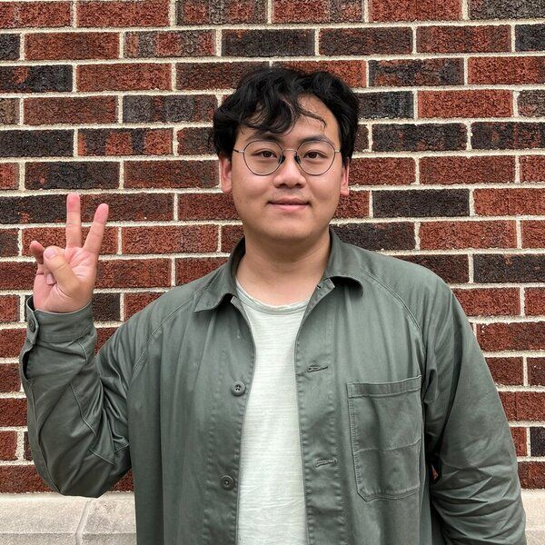
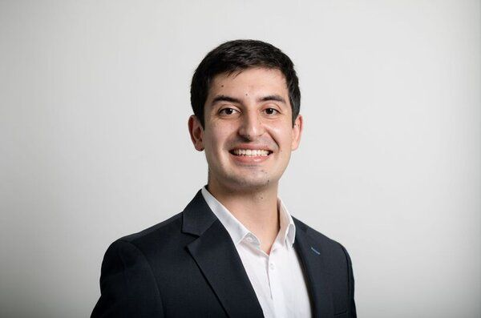

<!-- Embedding Font Awesome for ORCID icon -->

<!-- Main -->

<!-- One -->
<section id="one">
 

  <header class="major">
   <h2>Post-doctoral fellow</h2>
  </header>
 

</section>

<!-- Two -->
<section id="two" class="spotlights">
 <section>
  
  

   

    <header class="major">
     <h3>Zedong Peng</h3>
    </header>
    <li>Joined in Summer 2023.</li>
    <li>Ph.D., Control Science and Engineering, Zhejiang University, 2021.</li>
                
<b>Research topic</b>: Superstructure Optimization, Mixed-Integer Nonlinear Programming.

   <!-- <h4>Icons</h4> -->
 <ul class="icons">
  <li><a href="https://github.com/ZedongPeng" class="icon fa-github">Github</a></li>
        <li><a href="https://www.linkedin.com/in/zedong-peng-1a97b0118/" class="icon fa-linkedin">Linkedin</a></li>
  <li><a href="mailto:peng372@purdue.edu" class="icon fa-envelope">Email</a></li>
  <li><a href="https://orcid.org/0000-0001-6001-1738" class="fab fa-orcid" style="text-decoration: none; border: none;"></a></li>
 </ul>
   

  

 </section>
</section>

<!-- eighteight -->
<section id="eigheight" class="spotlights">
 <section>
  
  

   

    <header class="major">
     <h3>Amandeep Singh Bhatia</h3>
    </header>
    <li>Joined in Jan 2024.</li>
    <li>Ph.D., Computer Science and Engineering, Thapar University, 2020.</li>
                
<b>Research topic</b>: Quantum/classical machine learning, Quantum federated learning, Quantum algorithms, Optimization, Quantum Tensor Networks.

   <!-- <h4>Icons</h4> -->
 <ul class="icons">
  <li><a href="https://github.com/deepquantum88" class="icon fa-github">Github</a></li>
        <li><a href="https://www.linkedin.com/in/amandeep-singh-bhatia-phd-07b83822/" class="icon fa-linkedin">Linkedin</a></li>
  <li><a href="mailto:bhatia87@purdue.edu" class="icon fa-envelope">Email</a></li>
 </ul>
   

  

 </section>
</section>

<section id="two" class="spotlights">
    <section>
     
     

      

       <header class="major">
        <h3>Carolina Tristan</h3>
       </header>
       <li>Joined in Jan 2024.</li>
       <li>Ph.D., Chemical Engineering, University of Cantabria, 2023.</li>
                   
<b>Research topic</b>: Superstructure Optimization, Generalized Disjunctive Programming, Process System Engineering.

      <!-- <h4>Icons</h4> -->
    <ul class="icons">
     <li><a href="https://github.com/tristantc" class="icon fa-github">Github</a></li>
           <li><a href="https://www.linkedin.com/in/carolina-trist%C3%A1n-teja-3533582b4/" class="icon fa-linkedin">Linkedin</a></li>
     <li><a href="mailto:ctristan@purdue.edu" class="icon fa-envelope">Email</a></li>
    </ul>
     

    

   </section>
</section>

<!-- Three -->
<section id="three">
 

  <header class="major">
   <h2>Doctoral Student</h2>
  </header>
 

</section>

<!-- Four -->
<section id="four" class="spotlights">
 <section>
  
  

   

    <header class="major">
     <h3>Albert Lee</h3>
    </header>
    <li>Joined in Fall 2022.</li>
    <li>BEng, Chemical Engineering, Korea University, 2021.</li>
    
<b>Research topic</b>: Superstructure Optimization, Generalized Disjunctive Programming.

    <ul class="icons">
     <li><a href="https://github.com/AlbertLee125" class="icon fa-github">Github</a></li>
     <li><a href="https://www.linkedin.com/in/albert-lee-45570a24b/" class="icon fa-linkedin">Linkedin</a></li>
    <li><a href="mailto:lee4382@purdue.edu" class="icon fa-envelope">Email</a></li>
    <li><a href="https://orcid.org/0000-0002-4474-3266" class="fab fa-orcid" style="text-decoration: none; border: none;"></a></li>
    </ul>
   

  

 </section>
</section>

<section id="four" class="spotlights">
 <section>
  
  

   

    <header class="major">
     <h3>Anurag Ramesh</h3>
    </header>
    <li>Joined in Fall 2023</li>
    <li>BE, Chemical Engineering, Birla Insitute of Technology and Science Pilani, 2023.</li>
    
<b>Research topic</b>: Benchmarking Classical and Quantum Algorithms for Optimization and Computational Chemistry.

    <ul class="icons">
     <li><a href="https://github.com/anurag-r20" class="icon fa-github">Github</a></li>
     <li><a href="https://www.linkedin.com/in/anuragr20" class="icon fa-linkedin">Linkedin</a></li>
    <li><a href="mailto:rames102@purdue.edu" class="icon fa-envelope">Email</a></li>
    </ul>
   

  

 </section>
</section>

<section id="four" class="spotlights">
 <section>
  
  

   

    <header class="major">
     <h3>Yirang Park</h3>
    </header>
    <li>Joined in Fall 2023</li>
    <li>BSc, Chemical Engineering, University of California, Berkeley, 2015.</li>
    <li>Professional MSc, Chemical Engineering, Purdue University, 2019.</li>
    
<b>Research topic</b>: Pharmaceutical Process Synthesis and Optimization.

    <ul class="icons">
     <li><a href="https://github.com/parkyr" class="icon fa-github">Github</a></li>
     <li><a href="https://www.linkedin.com/in/yirangp/" class="icon fa-linkedin">Linkedin</a></li>
    <li><a href="mailto:park407@purdue.edu" class="icon fa-envelope">Email</a></li>
    <li><a href="https://orcid.org/0009-0008-6629-3308" class="fab fa-orcid" style="text-decoration: none; border: none;"></a></li>
    </ul>
   

  

 </section>
</section>

<!-- Five -->
<section id="five">
 

  <header class="major">
   <h2>Visiting Scholars</h2>
  </header>
 

</section>

<!-- Six -->
<section id="six" class="spotlights">
 <section>
  
  

   

    <header class="major">
     <h3>Pedro Maciel Xavier</h3>
    </header>
    <li>Joined in Fall 2023.</li>
    <li>BEng, Computer &amp; Information Engineering, Federal University of Rio de Janeiro, 2022.</li>
    <li>BSc, Mathematics, Federal University of Rio de Janeiro, 2022.</li>
    
<b>Research topic</b>: Quantum Optimization

    <ul class="icons">
     <li><a href="https://github.com/pedromxavier" class="icon fa-github">Github</a></li>
     <li><a href="https://www.linkedin.com/in/pedro-maciel-xavier/" class="icon fa-linkedin">Linkedin</a></li>
    <li><a href="mailto:pedrox@cos.ufrj.br" class="icon fa-envelope">Email</a></li>
    </ul>
   

  

 </section>
</section>

<!-- Nine -->
<!-- <section id="nine">
	

		<header class="major">
			<h2>Visiting Scholar</h2>
		</header>
	

</section> -->

<!-- Seven -->
<section id="seven" class="spotlights">
 <section>
  
  

   

    <header class="major">
     <h3>Andres F. Cabeza</h3>
    </header>
    <li>Joined in Fall 2023.</li>
    <li>BEng, Chemical Engineering, Universidad Nacional de Colombia, Manizales, 2017.</li>
    <li>MSc, Chemical Engineering, Universidad Nacional de Colombia, Bogotá, 2022.</li>
    
<b>Research topic</b>: Process Systems Engineering, Process Intensification

    <ul class="icons">
     <li><a href="https://github.com/andres9403" class="icon fa-github">Github</a></li>
     <li><a href="https://www.linkedin.com/in/andres-f-cabeza-2075a3149/" class="icon fa-linkedin">Linkedin</a></li>
     <li><a href="mailto:acabezap@purdue.edu" class="icon fa-envelope">Email</a></li>
     <li><a href="https://orcid.org/0009-0008-5932-564X" class="fab fa-orcid" style="text-decoration: none; border: none;"></a></li>
    </ul>
   

  

 </section>
</section>

<!-- Eight -->
<section id="eight" class="spotlights">
 <section>
  
  

   

    <header class="major">
     <h3>Juan S. Rodríguez F.</h3>
    </header>
    <li>Joined in Spring 2024.</li>
    <li>BEng, Chemical Engineering, Universidad Nacional de Colombia, Bogotá, 2017.</li>
    <li>MSc, Chemical Engineering, Universidad Nacional de Colombia, Bogotá, 2020.</li>
    
<b>Research topic</b>: Supply chain optimization. Metaheuristic optimization algorithms

    <ul class="icons">
     <li><a href="https://github.com/jsrodriguezf" class="icon fa-github">Github</a></li>
     <li><a href="mailto:rodr1200@purdue.edu" class="icon fa-envelope">Email</a></li>
     <li><a href="https://orcid.org/0000-0001-7348-3857" class="fab fa-orcid" style="text-decoration: none; border: none;"></a></li>
    </ul>
   

  

 </section>
</section>

<!-- 98 -->
<section id="ninety-eight">
 

  <header class="major">
   <h2>Principal Investigator</h2>
  </header>
 

</section>

<!-- 99 -->
<section id="ninety-nine" class="spotlights">
 <section>
  
  

   

    <header class="major">
     <h3>David E. Bernal Neira</h3>
    </header>
    <li>Started officially in Fall 2023.</li>
    <li><a href="1-bernalde.html">Main information</a>.</li>
    <ul class="icons">
     <li><a href="https://github.com/bernalde" class="icon fa-github">Github</a></li>
     <li><a href="https://www.linkedin.com/in/bernalde/" class="icon fa-linkedin">Linkedin</a></li>
    <li><a href="mailto:dbernaln@purdue.edu" class="icon fa-envelope">Email</a></li>
    </ul>
   

  

 </section>
</section>

