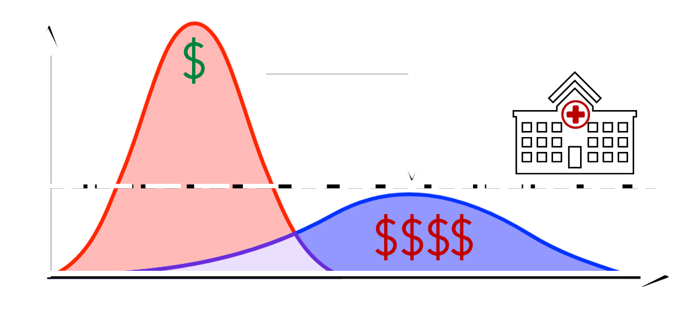

# Overview

Recent disease outbreaks (e.g., Covid-19) have highlighted the need for enhanced analysis and modeling of disease spread to better inform public policy on effective mitigation measures. In early work, I leveraged the <b>new risk assessment metrics</b> (developed using my [unifying abstraction for infinite-dimensional optimization](/research/infiniteopt.html)) to plan optimal isolation policies that effectively limit contagion spread with minimal economic impact. Currently, I am working with Prof. Carl Laird at Carnegie Mellon University (CMU) and others on developing rigorous analysis methods to characterize the dynamic transmission rates of Covid-19 based on historical case data. Here, we seek efficient mathematical approaches to estimate the impact of mitigation policies (e.g., mask mandates and school closures) on controlling transmission rates.

<ul class="actions">
    <li><a href="/research.html#disease" class="button icon fa-arrow-left">Go back to Research Summaries</a></li>
</ul>