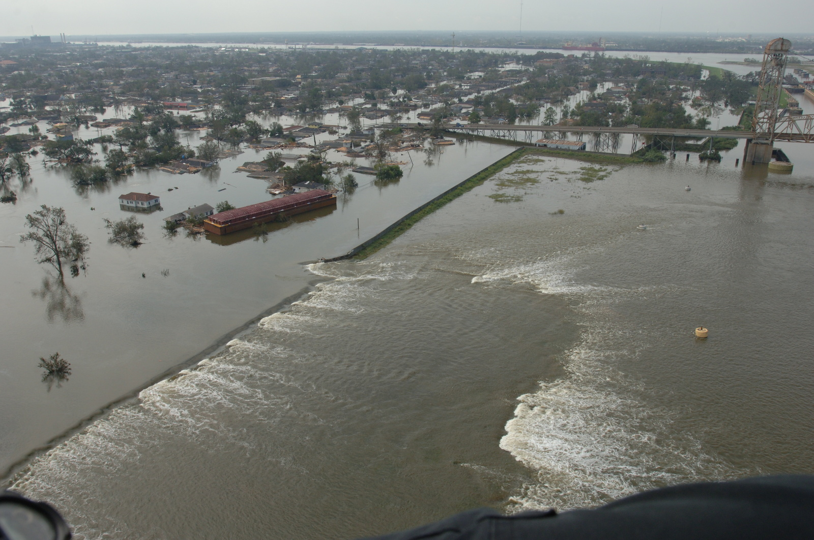
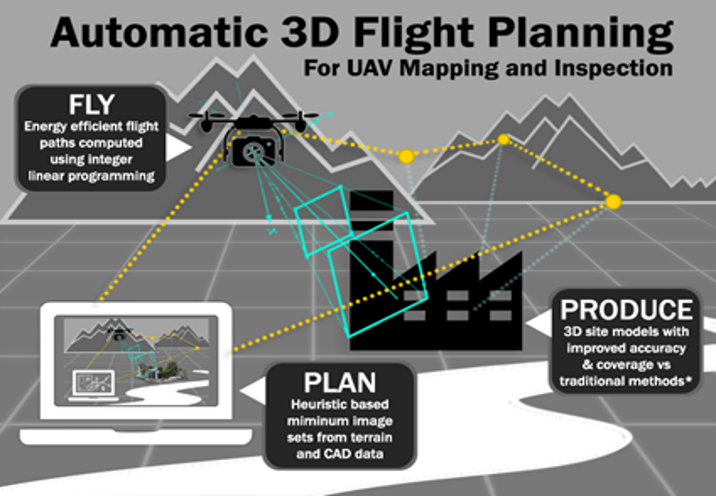

# Background

Infrastructure in the U.S. and abroad requires <b>frequent monitoring and inspection to proactively repair</b> damaged sections to avoid catastrophic failures. For instance, inadequate monitoring of New Orleans' 192 miles of levees led to over 50 failures when Hurricane Katrina struck in 2005 which caused 80% of New Orleans to flood. Standard practice is to use manual inspection (e.g., having a person visually inspect) which typically is impractical to conduct on a regular basis. Thus, <b>unmanned aerial vehicles</b> (UAVs) have become increasingly deployed to <b>expedite monitoring</b>, but typically operators need still need to review the footage manually which is time-consuming. 

# Proposed Solution

We developed a methodology and software framework that enables UAVs to <b>autonomously collect optimal image data</b> in order to construct high-fidelity <b>3D structure-from-motion models</b> which enable rapid inspection and <b>automated change detection</b>. In this framework, we developed a rigorous optimization approach to minimize image collection time while achieving a target inspection coverage. This is all implemented in Volare (an Android app) which can interface with UAVs manufactured by DJI. To date, this has been deployed to inspect infrastructure across the globe in places such as Italy, Japan, the U.S., and Chile. Check out the 3D augmented reality models [here](http://prismweb.groups.et.byu.net/gallery2/).

<ul class="actions">
    <li><a href="/research.html#drone" class="button icon fa-arrow-left">Go back to Research Summaries</a></li>
</ul>