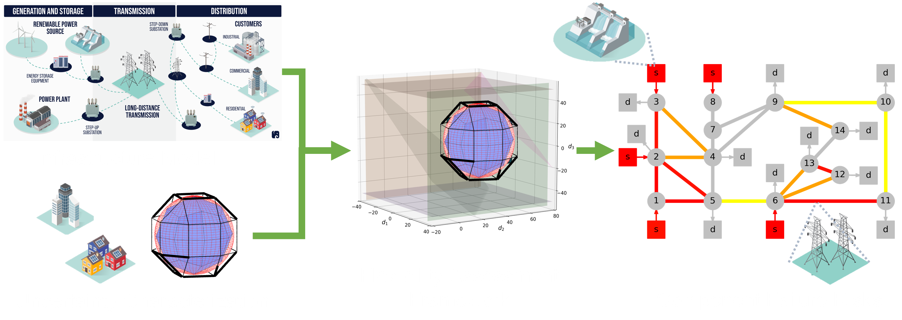

# Background
Rare, high-impact events (e.g., extreme weather, international conflicts) can inflict severe disruption/damage to energy infrastructure. In early 2021, extreme winter weather caused a power crisis in Texas (due to inadequate weatherproofing) causing the loss of over 200 people and \$200 billion in damages. Mathematical strategies are needed to model the effect of rare events on energy infrastructure. The Department of Energy (DoE) project Multifaceted Mathematics for Rare, High-Impact Events in Complex Energy and Environment Systems (MACSER) addresses this challenge. Under the MACSER project, and in collaboration with colleagues at the University of Wisconsin-Madison (UW-Madison), Argonne National Laboratory (ANL), Pacific Northwest National Laboratory (PNNL), and the University of Chicago (UChicago), much of my PhD focused on developing computational frameworks for assessing/designing <b>robust energy systems</b> subject to rare event uncertainty.

# Assessment and Design Frameworks

I proposed a framework to more accurately quantify the <b>flexibility</b> (the ability to feasibly operate with random fluctuations) of <b>complex energy infrastructure</b> (which I implemented in the software tool [FlexibilityAnalysis.jl](https://pulsipher.info/FlexibilityAnalysis.jl/stable/). Moreover, I developed a strategy for designing flexible energy systems that is <b>orders of magnitude faster</b> than previous techniques, enabling us to design real-world sized systems that were previously intractable. These insights led me to also develop a comprehensive framework for assessing and designing the <b>reliability</b> (the ability to operate with random equipment failure) of energy infrastructure networks, critical to avoid significant disruptions like the Texas power crisis.

These advancements, and many others developed by collaborators, motivated the need for a mathematical framework to commonly express these techniques to promote theoretical crossover, collaboration, and accessibility. I leveraged my unique expertise to engender a <b>unifying mathematical abstraction</b> for decision-making problems characterized over time, space, and/or uncertainty (i.e., infinite-dimensional optimization problems). This unifying abstraction is implemented in [InfiniteOpt.jl](https://infiniteopt.github.io/InfiniteOpt.jl/stable/) which now has a large, diverse user-base. This has enabled a <b>software-accelerated research</b> paradigm that is highly productive in driving scientific discovery. Learn more [here](/research/infiniteopt.html).

<ul class="actions">
    <li><a href="/research.html#energy" class="button icon fa-arrow-left">Go back to Research Summaries</a></li>
</ul>