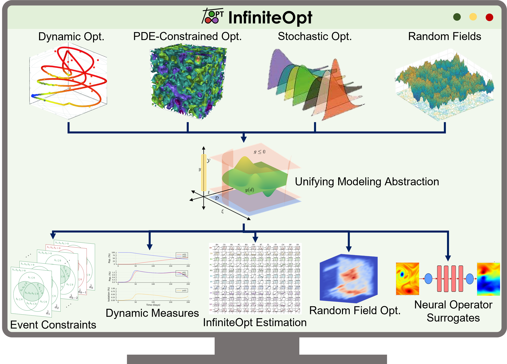

# Background
Infinite-dimensional optimization (InfiniteOpt) problems contain variables that are defined over continuous spaces such as states over a space-time field or states under uncertainty. This classification of problems commonly embed <b>complex modeling elements</b> that include: measures (e.g., multi-dimensional integrals), differential algebraic equations (DAEs), and partial differential equations (PDEs). InfiniteOpt problems encompass a wide breadth of optimization fields that include stochastic optimization, dynamic optimization, PDE-constrained optimization, and combinations (e.g., stochastic PDEs). Applications pertaining to these optimization fields include model predictive control, process design, parameter estimation, reliability analysis, design of dynamic experiments, and more. Moreover, although problems in the aforementioned optimization fields are often identified as InfiniteOpt problems, there exists a <b>conceptual gap in abstracting these problems rigorously through a common lens</b>. Coherent abstractions play a key role in <b>accelerating discovery</b> and enabling general modeling languages.

# Unifying Abstraction

To address the above gap, I developed  a <b>unifying abstraction for infinite-dimensional optimization</b> problems. This abstraction enables us to <b>navigate the complexity</b> in modeling/optimizing systems involving continuous domains (e.g., space-time, uncertainty). This integrates a number of distinct optimization fields to facilitate <b>theoretical crossover that has led to several scientific discoveries</b> such as highly accurate model identification for dynamic systems, new risk assessment metrics for decision-making, [characterizing uncertainty via random field theory](/research/rfo.html), the incorporation of [neural operator surrogates](/research/neuralops.html) into decision-making, and event-constrained optimization; all of which have inspired a <b>significant number of publications</b>. Moreover, I implemented the abstraction in the Julia software package [InfiniteOpt.jl](https://infiniteopt.github.io/InfiniteOpt.jl/stable/) which has amassed a large number of users across a wide breadth of application areas. This software package has also helped <b>accelerate scientific discoveries</b> and ensure these are <b>accessible</b> to individuals in diverse disciplines. For instance, InfiniteOpt.jl recently enabled evolutionary biologists to compare the paths chosen by mice against rigorous path planning determined by advanced decision-making techniques.

<ul class="actions">
    <li><a href="/research.html#infiniteopt" class="button icon fa-arrow-left">Go back to Research Summaries</a></li>
</ul>