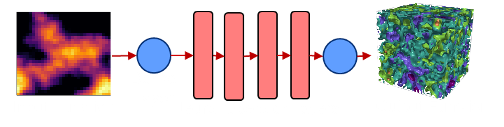

# Background
Many systems in engineering and science are modeled using variables that live on <b>continuous domains</b> (e.g., space-time), making them infinite-dimensional (i.e., variables are functions). Specific engineering applications include REE-CM supply chains, wildfire simulations, process systems, climate modeling, reaction surfaces, microbial communities, complex fluid flows, and molecular dynamics. My [unifying abstraction](/research/infiniteopt.html) (InfiniteOpt) enables simultaneous innovation across these areas. A common challenge pertains to complex systems which cannot be modeled from 1st principles and/or incur <b>high computational cost</b>.

Nueral operators networks generalize popular neural networks to learn an operator that maps between functions instead of simply learning a single function. This has enabled neural operators to become the state-of-the-art in learning highly complex space-time systems (e.g., turbulent fluid flow). These highly effective models have gained a lot of traction in the machine learning community but have seen little use in mathematical programming.

# Proposed Approaches
We propose to use neural operators as InfiniteOpt surrogates. To enable this, we will also engineer <b>constraint representations of neural operators</b> that embed in InfiniteOpt formulations. Taking inspiration from physics-informed neural network based control, we will also create a <b>physics-informed decision-making framework that uses neural operators</b>. Moreover, we plan to implement our scientific discoveries in \texttt{InfiniteOpt.jl</b> to promote accessibility and accelerate research in a wide breadth of disciplines.

<ul class="actions">
    <li><a href="/research.html#neuralops" class="button icon fa-arrow-left">Go back to Research Summaries</a></li>
</ul>