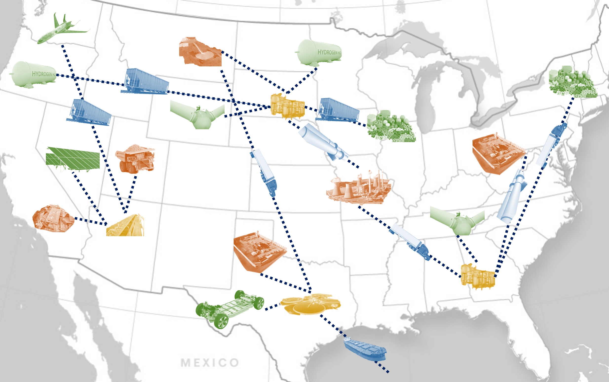

# Background
Establishing a <b>sustainable and economically viable domestic REE-CM supply chain</b> is a high priority to industry and the U.S. government, and is essential to avoid disruptions in manufacturing key technological products. Hence, the DoE recently awarded $19 million to 13 REE-CM related projects at universities throughout the U.S. under the direction of NETL. These efforts seek to better identify sources of REE-CMs from coal and coal by-products (e.g., coal ash) in U.S. coal basins and seek to further develop separation/refinement technologies. However, determining how to design a viable REE-CM supply chain remains a largely unaddressed challenge. Here, key decisions pertain to source selection, technology placement, raw-material transportation, and required government policies (if any), which are highly coupled and <b>multi-scale</b> in nature. Moreover, these considerations are subject to <b>time-dependent uncertainties</b> such as REE-CM recovery yields and material demand. Data-science and decision-making strategies are well-suited for tackling this challenge, but these have seen very limited use in REE-CM research.

# Modeling and Decision-making Framework

My group proposes to answer these key questions by developing a rigorous modeling and decision-making framework to design REE-CM infrastructure and supply chains. This will enable us to <b>model candidate infrastructure</b> configurations, optimally choose components (i.e., sources, technologies, transportation, end-uses), and facilitate <b>techno-economic analysis</b> under uncertainty. We can also investigate economic opportunities for cooperation across this multi-enterprise network. We will leverage state-of-art approaches such as <b>neural operator surrogates</b> and decision-making with <b>random field uncertainty</b>.

<ul class="actions">
    <li><a href="/research.html#ree" class="button icon fa-arrow-left">Go back to Research Summaries</a></li>
</ul>