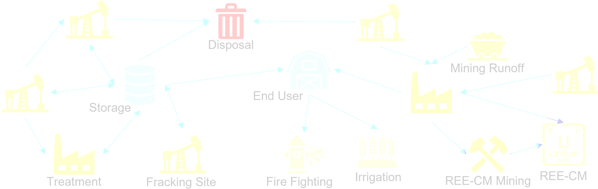

# Background
Rare earth elements (e.g., yttrium) and critical materials (e.g., lithium) are crucial for manufacturing electronics, pharmaceuticals, batteries, renewable energy generators, and more. Establishing a viable domestic REE-CM supply chain is a critical concern of multiple U.S. agencies. Intriguingly, <b>wastewater streams</b> (e.g., produced water) can contain appreciable concentrations of REE-CMs, which may incentivize the costly treatment of produced water to mitigate its impact. 

# Decision-making Framework

Prof. Carl Laird and I jointly proposed to develop a <b>decision-making framework</b> to explore exploiting produced water for REE-CM recovery and how this influences the economic viability of treatment. This framework will consider the design and operation of a <b>multi-enterprise water network</b> to treat/transport/reuse produced water and potentially incorporate other REE-CM sources (e.g., fly ash from coal energy, acid runoff from mining). This proposal was recently approved by the DoE for <b>$550k in funding</b>. We are collaborating with the Produced Water Application for Beneficial Reuse, Environmental Impact, and Treatment Optimization (PARETO) project teams at National Energy Technology Laboratory (NETL) and Lawrence Berkeley National Laboratory which work closely with a variety of industrial stakeholders. The expertise and collaboration I am cultivating in this project will continue into my future research.

<ul class="actions">
    <li><a href="/research.html#wastewater" class="button icon fa-arrow-left">Go back to Research Summaries</a></li>
</ul>