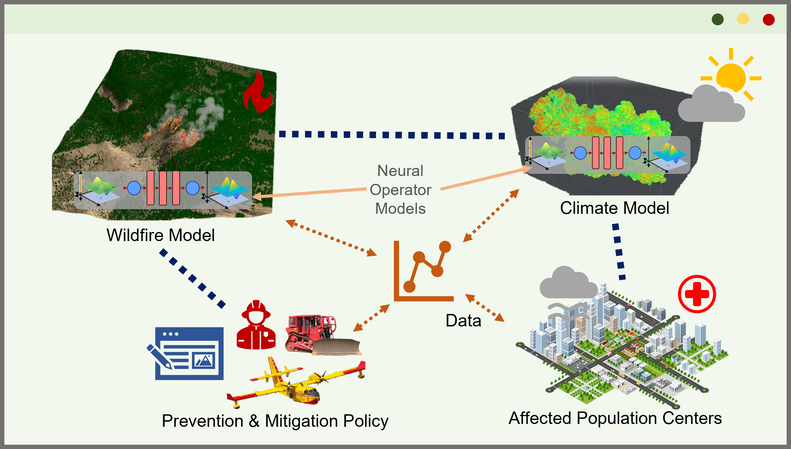

# Background
Climate change is driving an <b>increase in wildfire extent and severity</b>. Recently, the 2018 Camp Fire burned 150,000+ acres, destroyed nearly 19,000 buildings (costing $16.5 billion), killed 85 people, and contributed to hundreds of excess deaths from poor air quality. Consequently, the U.S. spends $1+ billion annually to combat wildfires. Increases in fire activity, wildland urban interfaces, suppression costs, and controlled burn hazards suggest that current <b>fire management practices are unsustainable</b> and a fundamental shift from reactive to proactive responses is needed. More advanced modeling and decision-making tools are key to directing this paradigm shift. However, wildfires entail highly complex characteristics such as intricate combustion dynamics and external space-time uncertainties (e.g., weather, vegetation composition). Research is underway for <b>high-fidelity wildfire models</b> that accurately capture behavior and widespread impacts (e.g., air pollution). Challenges include modeling large terrains, procuring adequate data, and embedding these models in decision-making strategies.

# Proposed Solution

My group will engineer <b>scalable surrogate wildfire models</b> that guide data collection (monitoring) and readily embed into decision-making tools. Inspired by the success of neural operator models in emulating chaotic Navier-Stokes flow systems, we plan to develop <b>physics-informed neural operator models</b> to create high-fidelity models that rapidly predict wildfire behavior. With these we can conduct <b>scalable uncertainty propagation</b> to guide data collection (monitoring). Moreover, the computational efficiency of these surrogates facilitates the integration of high-fidelity models (e.g., fire and weather simulators) into decision-making tools, promoting <b>better informed fire-management strategies</b>. For instance, these can consider the impact of smoke from controlled burns on surrounding population areas. This work will be done in close collaboration with experts in wildfire research.

<ul class="actions">
    <li><a href="/research.html#wildfire" class="button icon fa-arrow-left">Go back to Research Summaries</a></li>
</ul>